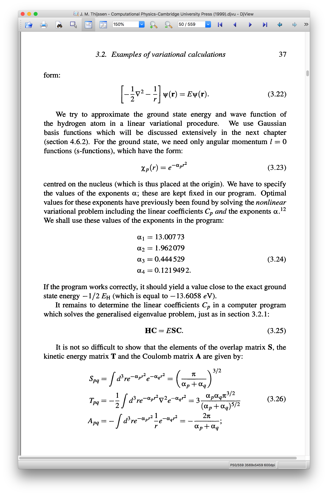

### Equations are from Thijssen

- `full_variational.py` treats both the expansion coeficient and basis parameter as variational parameters. 
- `variational_eigh.py` treats the basis parameters as variational parameters, and gets the expansion coeficients via a generalized eigensolver. This highlights that one is able to differentiate through the eigensovler. 

